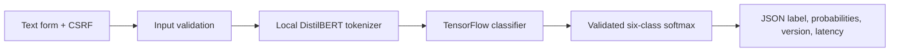

# Tweet Emotion Recognition

A six-class NLP experiment and Django inference UI for sadness, joy, love, anger, fear, and
surprise. The notebook compares a scratch text model with a DistilBERT classifier.

## Architecture



Inference is separated from HTTP handling. Model loading is lazy and local-only; missing
weights return a safe 503 instead of preventing Django startup. Responses validate the
six-class output schema. The UI renders returned user text as text, never as HTML.

## Current artifact status

The export directory contains tokenizer/configuration/label files but **no trained weights**.
Real transformer inference is unavailable until the matching `tf_model.h5` from the original
training run is supplied. The checked-in notebook records a scratch-model test accuracy near
0.725; this historical output is not a newly reproduced result and does not establish the
missing transformer's quality.

## Setup

```bash
python -m venv .venv
source .venv/bin/activate  # Windows: .venv\Scripts\activate
pip install -r requirements.txt ruff
cd tweet_emotion_django_app
python manage.py migrate
python manage.py runserver
```

Export the variables in `.env.example`. The lightweight dependencies start the UI and tests.
For real inference, install `requirements-ml.txt` and supply the trained weights under
`tweet_emotion_django_app/export_emotion_model/`. The transformer version matches the export
configuration; no automatic architecture or model substitution is performed.

`POST /predict/` accepts the form field `text` (1–4000 characters). It returns 400 for invalid
input, 405 for the wrong method, and 503 when model inference is unavailable. `/health/`
reports liveness and artifact/load state; it does not claim model readiness from configuration
files alone.

## Verification

```bash
ruff check tweet_emotion_django_app/predictor tweet_emotion_django_app/tweet_emotion_site
ruff format --check tweet_emotion_django_app/predictor tweet_emotion_django_app/tweet_emotion_site
cd tweet_emotion_django_app
python manage.py test predictor
```

Tests cover stable softmax, six-class validation, label mapping, fake-model inference, missing
weights, HTTP validation, CSRF, and a mocked success response. GitHub Actions repeats these
checks without downloading a model. Real model loading, prediction quality, and deployment
remain unverified. No database beyond Django's local framework state, cloud deployment,
orchestration, or Docker service is added without a working artifact and useful operational
requirement.
